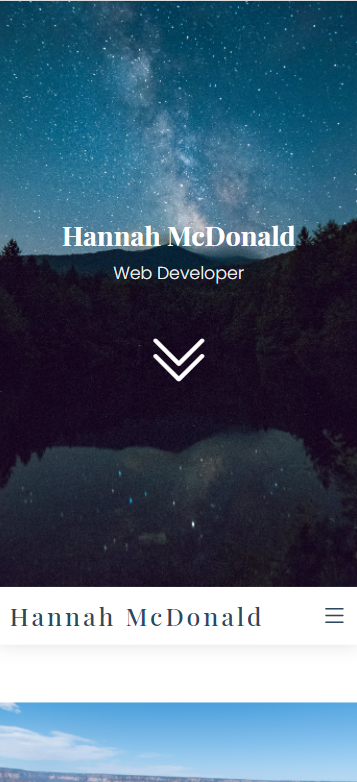
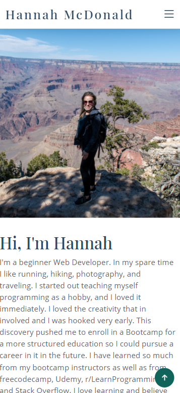
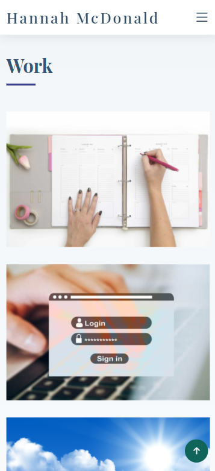
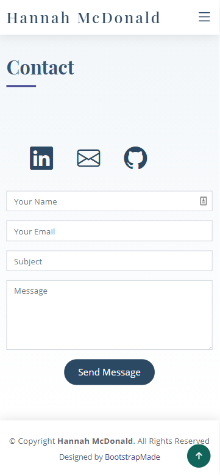

# PortfolioPageUpdate

Deployed Application: https://hannahnmcdonald.github.io/PortfolioPageUpdate/

# Description

A portfolio web page to display my work, resume, and a brief bio to show to employers. This portfolio is a concise and simple web page that is mobile responsive which displays all the applications I have created along with links to their deployed site. I have a link to my resume as well for future employers to view in addition to my LinkedIn page and my github where they can find more of my work and projects.

Mobile Layout:

# Credits

Bootstrap! 

It was so nice to work with a CSS framework this time around making my portfolio! I used bootstrap layouts and made some minor changes to the link icons and photos involved. 

# Installation

n/a

# Usage

n/a

# Questions?

Email me at hannahcodes@protonmail.com
